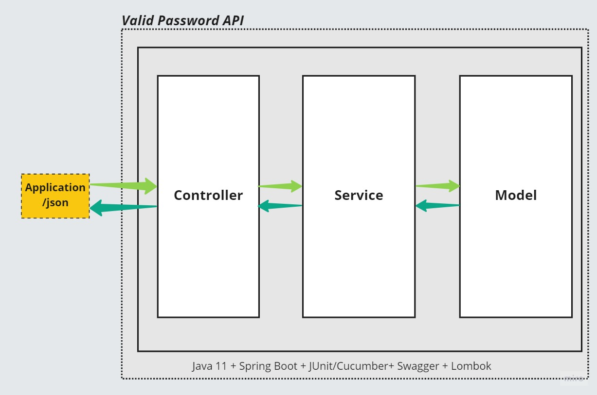

# validpassword-api

Web API that validates if a password is valid

Documentation available at http://localhost:8080/swagger-valid-password-api.html

####Mandatory password:
```
Nine or more characters
At least 1 digit
At least 1 lowercase letter
At least 1 capital letter
At least 1 special character !@#$%^&*()-+
Do not have repeated characters within the set
```
####Macro Architecture:


----
####Request Examples:

```
Scenario Outline: client makes call to POST /v1/password
    When the client calls /v1/password with a "<textPassword>" valid
    Then the client receives status code of 200
    And the client receives the true
```

```json
curl -X POST "http://localhost:8080/v1/password" 
      -H  "accept: application/json" 
      -H  "Content-Type: application/json" 
      -d "{\"text\":\"AbTp9!fok\"}"
```
Response:
```
true
```

 ----
```
 Scenario Outline: client makes call to POST /v1/password invalid
      When the client calls /v1/password with a "<textPassword>" invalid
      Then the client receives status code of 400
      And the client receives the false
```
 ```json
curl -X POST "http://localhost:8080/v1/password" 
      -H  "accept: application/json" 
      -H  "Content-Type: application/json" 
      -d "{\"text\":\"AbTp9 fok\"}"
```
Response:
```
false
```

----
```
Scenario Outline: client makes call to POST /v1/password without password throw validation error
     When the client calls /v1/password with a "<textPassword>"
     Then the client receives status code of 400
     And I should see a validation error
```
 ```json
curl -X POST "http://localhost:8080/v1/password" 
      -H  "accept: application/json" 
      -H  "Content-Type: application/json" 
      -d "{}"
```
Response:
```
{
  "message": "The password can't be null",
  "error": "NotNullPassword"
}
```
###Some keypoints of the developed solution:
-	Used Spring Boot due to its time optimization, thus improving productivity.

-	Used Regex for the password validation logic, due it’s simplicity and efficiency.

-	Used Lombok to minimize lines of code, making it easier for other developers to read.

-	Decided to go with a Model and not an Entity, because in this application there was no need to work with a database.

-	Assumed that the StatusCode for an invalid password, should be 400 - Bad Request, since the data sent by the client did not follow the minimum requirements and the request was able to be executed by the server.

-	Used Cucumber and JUnit for integration and unit tests, thus ensuring the readability of the tests and  the integrity of the code.

-	Used Swagger  for documentation.


###Author


<a href="https://www.linkedin.com/in/ricardo-domingues27/">
 
 <br />
 <sub><b>Ricardo Domingues</b></sub></a> 


Made with ❤️ by Ricardo Domingues 👋🏽!

[](https://www.linkedin.com/in/ricardo-domingues27/)
[](mailto:ricardo.domingues27@gmail.com)